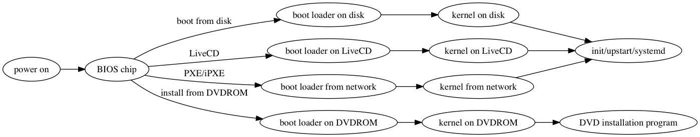

本文档记录了一种在机群里安装 CoreOS 的方法。分两步，第一步使用 PXE 引导完全存在于内存的 CoreOS，第二步将 CoreOS 安装到硬盘。

[这篇文档](pxe-on-rasppi/README.md)描述了使用 Raspberry Pi 作为 PXE server 的方法。

# 使用 PXE 引导并安装 CoreOS 至硬盘

## 什么是 PXE

下面引自 wikipedia 上关于 PXE 的介绍：

> 预启动执行环境（Preboot eXecution Environment，PXE，也被称为预执行环境)提供了一种使用网络接口（Network Interface）启动计算机的机制。这种机制让计算机的启动可以不依赖本地数据存储设备（如硬盘）或本地已安装的操作系统。

为了便于理解 PXE，首先简单描述 Linux 操作系统引导的过程 （参考[本文]( http://www.tldp.org/HOWTO/Unix-and-Internet-Fundamentals-HOWTO/bootup.html)）：

当我们启动一台已经在硬盘中安装了 Linux 操作系统的服务器时，主板 BIOS chip 里的一段程序会首先执行，根据 BIOS 中的设置，它找到一个启动设备（通常是一个硬盘分区），并在这个启动设备的特定的位置找到一段代码并执行它。这段代码被称为 boot loader，我们现在常用的 boot loader 包括 GRUB 和 GRUB2 等。Boot loader 在硬盘上找到操作系统的 kernel，将它加载到内存，并启动它。kernel 首先去发现计算机上安装的硬件，这个过程称为 autoprobing。其后 kernel 会启动操作系统的第一个进程，这是一个初始化进程，它的名字可能是 init, upstart 或者 systemd，这个进程会继续启动一些 daemon 进程，完成操作系统的启动。

通过 LiveCD 引导的系统，启动过程近似，不同的是，上述过程中存在于硬盘上的 boot loader, kernel, 初始化进程和 daemon 进程现在是位于 CDROM/DVDROM 中。

一般通过 LiveCD 引导系统启动后，我们会运行一个安装程序，把操作系统安装到硬盘里。 使用 LiveCD 安装系统的方式有别于使用 CDROM/DVDROM 引导安装的方式，后者在 kernel 启动后运行的是一个安装向导程序，由它来完成系统的安装。

使用 PXE 安装操作系统和使用 LiveCD 安装操作系统的过程类似，都是先启动一个完整的操作系统，然后在这个系统里启动安装程序，将系统安装到硬盘上。不同点是，PXE 是通过网络从其他服务器上获取 boot loader, kernel 以及其他必要的应用程序。



下面是 PXE 引导的简单过程，详细介绍可以参考 [这一篇](https://docs.oracle.com/cd/E24628_01/em.121/e27046/appdx_pxeboot.htm#EMLCM12198) 和 [这一篇](http://www.syslinux.org/wiki/index.php?title=PXELINUX) 文档。

1. 机器启动的时候会广播一个 DHCP 请求，申请 IP 地址。我们应该配置 DHCP 服务器让它在response 里告知存放 boot loader 的 TFTP server 的 IP 地址以及 boot loader 在TFTP里的位置。
2. 网卡据此获得boot loader程序，并且执行之，由此启动操作系统。


## 手动安装 CoreOS 到硬盘

### 配置 PXE server

以下操作在一台运行 CentOS 7.1 的服务器上操作，这台服务器的 IP 地址是 `10.10.10.1`，它将用于提供 DHCP 服务，TFTP 服务，以及提供 cloud-config 文件。示例中使用了 `stable` channel 版本为 `1010.5.0` 的 CoreOS。

#### 安装软件

```bash
#!/bin/bash

CHANNEL=stable
VERSION=1010.5.0

sudo yum -y install tftp-server dhcp syslinux
sudo cp /usr/share/syslinux/pxelinux.0 /var/lib/tftpboot
sudo mkdir /var/lib/tftpboot/pxelinux.cfg
cd /var/lib/tftpboot
wget https://${CHANNEL}.release.core-os.net/amd64-usr/${VERSION}/coreos_production_pxe.vmlinuz
wget https://${CHANNEL}.release.core-os.net/amd64-usr/${VERSION}/coreos_production_pxe.vmlinuz.sig
wget https://${CHANNEL}.release.core-os.net/amd64-usr/${VERSION}/coreos_production_pxe_image.cpio.gz
wget https://${CHANNEL}.release.core-os.net/amd64-usr/${VERSION}/coreos_production_pxe_image.cpio.gz.sig
gpg --verify coreos_production_pxe.vmlinuz.sig
gpg --verify coreos_production_pxe_image.cpio.gz.sig
```
#### 配置 DHCP

编辑 `/etc/dhcp/dhcpd.conf`，增加以下两行：
```bash
next-server 10.10.10.1;
filename "pxelinux.0";
```
上述两行的作用是，当有一台机器通过本机的 DHCP 获取得 IP 后，它会以 `next-server`上的 `/var/lib/tftpboot/$filename` 作为 PXE 的 bootloader。

`/etc/dhcp/dhcpd.conf` 中还应该包括与 IP 地址分配相关的配置，请自行 Google。

#### 配置 pxelinux

编辑 `/var/lib/tftpboot/pxelinux.cfg/01-00-25-90-c0-f7-86`，文件名 01-00-25-90-c0-f7-86 由 01 (Ethernet 的 ARP type code) 和 MAC 地址组成，字母要小写，用 dash separators 隔开。当网卡 MAC 地址为 `00:25:90:c0:f7:86` 的机器通过运行于 10.10.10.1 的 DHCP 服务器获取到 IP 地址后，它会经由 PXE  来完成引导，它读取的配置文件就是 `/var/lib/tftpboot/pxelinux.cfg/01-00-25-90-c0-f7-86`。因此，我们可以在 `/var/lib/tftpboot/pxelinux.cfg/` 下为每一台要安装 CoreOS 的服务器放置一个不同的配置文件，文件名基于网卡的 MAC 地址。在 `/var/lib/tftpboot/pxelinux.cfg/` 还可以放置一个文件名为 `default` 的默认配置文件。

下面是 `/var/lib/tftpboot/pxelinux.cfg/01-00-25-90-c0-f7-86` 的内容

```bash
default coreos

label coreos
  kernel coreos_production_pxe.vmlinuz
  append initrd=coreos_production_pxe_image.cpio.gz cloud-config-url=http://10.10.10.1:8080/cloud-configs/00:25:90:c0:f7:86.yml
```

### 使用 PXE 引导 CoreOS

在主板的 BIOS chip 支持通过 PXE 协议启动的服务器上，修改 BIOS 设置，将通过网络引导放到其他引导方式前边，然后重启，后续后自动完成安装。


### 将 CoreOS 安装到硬盘

通过上述步骤启动的 CoreOS 是安全运行内存中的，包括它的 root 也是 mount 到一个存在于内存中的 tmpfs 中。如果希望摆脱对 PXE server 的依赖，同时能将后续的一些数据持久化，就要把 CoreOS 系统安装到硬盘上。

安装是通过 `/usr/bin/coreos-install` 这个 bash script 实现的。通过查看这个文件，发现要从 core-os.net 下载两个文件，即系统的 image 文件和它的 .sig 文件。由于从国内直接下载很慢，所以我先下载好后，自己建了一个 nginx 服务来提供下载。`coreos-install` 工具提供了 `-b BASEURL` 参数，可以指定从非官方地址下载。

```bash
wget http://10.10.10.1:8080/cloud-configs/00:25:90:c0:f7:86.yml
sudo coreos-install -d /dev/sda -c '00:25:90:c0:f7:86.yml' -b http://10.10.10.1:8080
```

执行  `coreos-install` 会下载 http://10.10.10.1:8080/1010.5.0/coreos_production_image.bin.bz2 和 http://10.10.10.1:8080/1010.5.0/coreos_production_image.bin.bz2.sig 两个文件，因此，10.10.10.1 的 nginx 的 data 目录结构应该是如下图所示（同一个 nginx 服务还提供 cloud-config 文件的下载）：

```
.
├── 1010.5.0
│   ├── coreos_production_image.bin.bz2
│   └── coreos_production_image.bin.bz2.sig
├── cloud-configs
│   ├── 00:25:90:c0:f6:d6.yml
│   ├── 00:25:90:c0:f6:ee.yml
│   ├── 00:25:90:c0:f7:62.yml
│   ├── 00:25:90:c0:f7:68.yml
│   ├── 00:25:90:c0:f7:7a.yml
│   ├── 00:25:90:c0:f7:7c.yml
│   ├── 00:25:90:c0:f7:7e.yml
│   ├── 00:25:90:c0:f7:80.yml
│   ├── 00:25:90:c0:f7:86.yml
│   ├── 00:25:90:c0:f7:88.yml
│   ├── 00:25:90:c0:f7:ac.yml
│   ├── 00:25:90:c0:f7:c8.yml
│   ├── 00:25:90:d0:a8:c4.yml
│   ├── 00:e0:81:ee:82:c4.yml
│   ├── d4:ae:52:c5:07:f9.yml
│   ├── install.sh
├── config
└── logs
    └── error.log
    ``````
```

* coreos-install 主要做了如下三件事：
  * 从 -b 指定的 URL 下载 .bz2 压缩的 img 文件，img 的 release channel 和 version 都与当前运行的系统相同。
  * 解压上述文件，将内容重定向到 -d 参数指定的 block device。这个过程会在 device 里产生 [9 个区分](https://coreos.com/os/docs/latest/sdk-disk-partitions.html)。
  * 将 -c 指定的 cloud-config 文件拷贝为安装好的系统的 /var/lib/coreos-install/user_data 文件。

### 关于可以用于安装的 device 类型

coreos-install 里通过 lsblk 来检查 -d 指定的 device 的类型，并且仅接受 disk, loop, lvm 三者之一。而根据我的安装经验，lvm logcial volume 无法用于安装，原因是上述 coreos-install 做的第二件事在此 device 上写了一个分区表，然后通过 ```blockdev --rereadpt <device>``` 调用通知系统重新读入分区表，但是 ```blockdev``` 并不支持 lvm logical volume 内分区表的读取。同样的，我在网上也看到有人使用 loopback device 安装时遇到一样的问题。


## 自动安装 CoreOS 到硬盘

上个 section 描述了手动安装 CoreOS 到硬盘的两个阶段，即首先由 PXE 引导启动一个所有挂载点都在内存中的系统，然后再手动安装系统到硬盘。在实际应用中，我们并不关心第一个步骤中启动的系统；而且由于我们要装很多台机器，一台一台手动安装很浪费时间，所以需要将上述步骤变成一个自动化的操作。这个 section 描述这个方法。

自动安装的过程主要利用了 `cloud-config` 文件本身既可以是一个 yaml 格式的配置文件，也可以是一个 shell script 文件这个特性，我们将安装系统到硬盘的操作写到一个 script 文件中，并以此文件作为  PXE 引导启动系统时使用 cloud-config 文件。系统启动后，会自动执行这个 script 文件，完成安装。

所以，在上个 section 描述的基础上，自动安装需要做如下修改：

* 配置 pxelinux：不再为每台机器单独提供一个配置文件，而是所有机器共享一个配置文件 `/var/lib/tftpboot/pxelinux.cfg/default`， 下面是它的内容：

  ```bash
  default coreos

  label coreos
    kernel coreos_production_pxe.vmlinuz
    append initrd=coreos_production_pxe_image.cpio.gz cloud-config-url=http://10.10.10.1:8080/cloud-configs/install.sh
  ```

* 配置用于 PXE 引导系统的 cloud-config 文件，即上面的配置文件中的 `http://10.10.10.1:8080/cloud-configs/install.sh`，它的内容如下：

  ```bash
  #!/bin/sh

  mac_addr=`ifconfig | grep -A2 'broadcast' | grep -o '..:..:..:..:..:..'`
  wget http://10.10.10.1:8080/cloud-configs/${mac_addr}.yml
  sudo coreos-install -d /dev/sda -c ${mac_addr}.yml -b http://10.10.10.1:8080
  sudo reboot
  ```


完成以上配置，从 PXE 引导 CoreOS 后，便可等待，直至系统被安装到硬盘。
