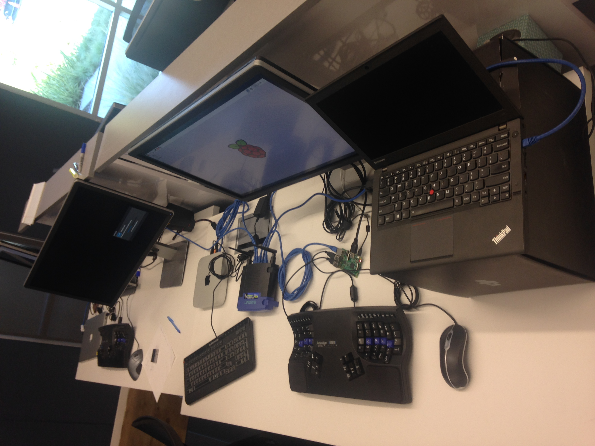

# PXE in the Office

I am trying to setup and run a PXE server, which can boot CoreOS on
other machines connected to my home router.

I happen to have a 32-bit Raspberry Pi with ARMv7l CPU and Raspbian
Linux 8:

```
pi@raspberrypi:~ $ cat /etc/os-release 
PRETTY_NAME="Raspbian GNU/Linux 8 (jessie)"
NAME="Raspbian GNU/Linux"
VERSION_ID="8"
VERSION="8 (jessie)"
ID=raspbian
ID_LIKE=debian
HOME_URL="http://www.raspbian.org/"
SUPPORT_URL="http://www.raspbian.org/RaspbianForums"
BUG_REPORT_URL="http://www.raspbian.org/RaspbianBugs"

pi@raspberrypi:~ $ uname -a
Linux raspberrypi 4.1.18-v7+ #846 SMP Thu Feb 25 14:22:53 GMT 2016 armv7l GNU/Linux
```

I am trying to make it the PXE server.

### Network Topology

I have a LinkSys router.  I plug its upstream cable to the Ethernet
slot on the wall of the office.  As shown in the following figure, I
plugged three downstream cables to

1. a Mac Mini running Ubuntu Linux, 
1. the Raspberry Pi, and
1. the MacBook Pro on which I work.



After booting all these computers, they got IP addresses from the router:

1. Mac Mini: 192.168.2.10
1. Raspberry Pi: 192.168.2.11
1. MacBook Pro: 192.168.2.12
1. SysLink router: 192.168.2.1

I can configure the router via a Web UI at `http://192.168.2.1`.  This
allows me to disable/enable the DHCP service of that router.
Currently, I keep it as "enabled".  The default IP range is from
192.168.2.10 to 192.168.2.249.

On this page, I can see that the subnet mask is `255.255.255.0`.

I can ssh to the Mac Mini and the Raspberry Pi.  On both of these
Linux comptuers, I can run `route -n` to find out the gateway IP
address, which is the router's IP address, `192.168.2.1`.

On all these computers, I did `curl www.gooogle.com` and verified that
I can access the Internet.  ### Install TFTP Server


### Install DHCP Server

A PXE server is a DHCP server that returns not only the IP address,
but also URL of OS images used to boot the target computer.

I got my idea about DHCP server on Ubuntu from 
[this tutorial](http://www.noveldevices.co.uk/rp-dhcp-server):

```
sudo apt-get install isc-dhcp-server
```

A PXE server needs a static IP address, so that target computers know
from where to download the OS images.  To do this, I edit the
`/etc/network/interfaces` file to assign `eth0` a static IP address
`192.168.2.10`.

```
auto eth0
iface eth0 inet static
address 192.168.2.10
netmask 255.255.255.0
gateway 192.168.2.1
dns-nameservers 8.8.4.4 8.8.8.8
```

Then I rewrote `/etc/dhcp/dhcpd.conf` to make the DHCP server
allocating IP addresses in the range from `192.168.2.11` to
`192.168.2.249`.  Please be aware that `192.168.2.10` is reserved for
the DHCP (PXE) server itself.

```
subnet 192.168.2.0 netmask 255.255.255.0 {
	range 192.168.2.11 192.168.2.249;
	option routers 192.168.2.1;
	option broadcast-address 192.168.2.255;
}

next-server 192.168.2.10;
filename "pxelinux.0";
```

Also, please be aware that `next-server` specifies the PXE server (it
is DHCP and TFTP server).

Now we can restart the server to make the configuration happen:

```
sudo service isc-dhcp-server restart
```

#### Test DHCP Service

After doing this, I disabled the DHCP service on the router via the
Web UI.  Then I restarted the Mac Mini.  After it reboots, it got new
IP address `192.168.2.13`.  It seems that the Raspberry Pi DHCP server
works.

I can ssh to Mac Mini using its new IP address.  But `curl
www.google.com` now fails:

```
yi@pxe:~$ curl www.google.com
curl: (6) Could not resolve host: www.google.com
```

This can be fixed by editing `/etc/resolv.conf` and add a line
`nameserver 8.8.8.8`.  For CoreOS target computers, we can make the
cloud-config file adding this line every time a target computer
starts.

```
write_files:
  - path: "/etc/resolv.conf"
    permissions: "0644"
    owner: "root"
    content: |
       nameserver 8.8.8.8
```	

Then I restarted the Raspberry Pi.  It boots into a status that the
DHCP server runs OK and it can resovle and access www.google.com.

Then I restarted the Mac Mini again.  It got `192.168.2.15`, an IP
address in the specified range.


### TFTP Server

I followed
[this tutorial](http://vinobkaranath.blogspot.com/2014/06/install-tftp-server-in-ubuntu-1404.html).
The only difference is that I use the default TFTP server path
`/srv/tftp`.

To test the TFTP server, I installed a client: `sudo apt-get install
tftp-hpa`, then run

```
echo Hello > /srv/tftp/hello
tftp 192.168.2.11 -c  get hello
cat ./hello
Hello
```

I noticed that the tftpd-hpa server is listening on 192.168.2.11, but
not on 127.0.0.1 (localhost).


### Boot Images

The boot image aforementioned in DHCP configuraton file was retrieved
from the pxelinux package:

```
sudo apt-get install pxelinux
sudo cp /usr/lib/PXELINUX/pxelinux.0 /var/lib/tftpboot/
```

When a target computer boots, it broadcasts a request for IP address.
The DHCP server responses an IP address and `next-server` and
`filename`.  If the network card and BIOS of the target computer
supports PXE, it would download the boot image from URL
`tftp://192.168.1.105/pxelinux.0` and keep this URL as *current
working directory*.  When it runs `pxelinux.0`, it lets it knows the
current working directory, so that `pxelinux.0` can load its
configuration file from there.

Suppose that the MAC address of the network card on the target
computer is `88-99-aa-bb-cc-dd`, then `pxelinux.0` will read
configuration file
`tftp://192.168.1.105/pxelinux.cfg/01-88-99-aa-bb-cc-dd`.  If that
file doesn't exists, it tries to read
`tftp://192.168.1.105/pxelinux.cfg/default`, or
`/var/lib/tftpboot/pxelinux.cfg/default`.

The content of our `/var/lib/tftpboot/pxelinux.cfg/default` is as
follows:

  ```
default coreos

label coreos
  kernel coreos_production_pxe.vmlinuz
  append initrd=coreos_production_pxe_image.cpio.gz cloud-config-url=http://192.168.1.105:8080/cloud-config/install-coreos
  ```
  
This configuration file tells `pxelinux.0` to download CoreOS images
`coreos_production_pxe.vmlinuz` and
`coreos_production_pxe_image.cpio.gz` form its current working
directory.  Then `pxelinux.0` will boot the system using the CoreOS
images.  To make this happen, we need to download CoreOS images:

```
CHANNEL=stable
VERSION=1010.5.0
cd /var/lib/tftpboot/
wget https://${CHANNEL}.release.core-os.net/amd64-usr/${VERSION}/coreos_production_pxe.vmlinuz
wget https://${CHANNEL}.release.core-os.net/amd64-usr/${VERSION}/coreos_production_pxe_image.cpio.gz
```

The pxelinux configuration file
`/var/lib/tftpboot/pxelinux.cfg/default` also specifies the
cloud-config file
`http://192.168.1.105:8080/cloud-config/install-coreos`, which will be
executed by CoreOS system after it boots.  We want this cloud-config
file installs CoreOS onto the disk of the target computer.

### Install CoreOS onto Disks

The above `http://` URL implies that we need to install Nginx (or any
other HTTP server) on the Mac Mini to host the cloud-config file.

## Pitfalls

### DHCP Server

When I start the DHCP server as follows, it complains and error:

```
pi@raspberrypi:/etc/dhcp $ sudo service isc-dhcp-server restart
Job for isc-dhcp-server.service failed. See 'systemctl status isc-dhcp-server.service' and 'journalctl -xn' for details.
```

But `systemctl status isc-dhcp-server.service` and `journalctl -xn` shows nothing interesting.

So I had a look at the file `/etc/init.d/isc-dhcp-server`, which is a
Shell script and invokes `/usr/sbin/dhcpd`.  This inspired me to run
`/usr/sbin/dhcpd` from the command line, which shows the reason -- I
got syntax errors in the configuration file:

```
pi@raspberrypi:/etc/dhcp $ /usr/sbin/dhcpd
Internet Systems Consortium DHCP Server 4.3.1
Copyright 2004-2014 Internet Systems Consortium.
All rights reserved.
For info, please visit https://www.isc.org/software/dhcp/
Config file: /etc/dhcp/dhcpd.conf
Database file: /var/lib/dhcp/dhcpd.leases
PID file: /var/run/dhcpd.pid
unable to create icmp socket: Operation not permitted
/etc/dhcp/dhcpd.conf line 8: semicolon expected.
filename 
 ^
/etc/dhcp/dhcpd.conf line 8: expecting a declaration

^
Configuration file errors encountered -- exiting
```

I simply added the missing semicolons, then `sudo service
isc-dhcp-server start` works and `systemctl status
isc-dhcp-server.service` shows that the service is running well.
