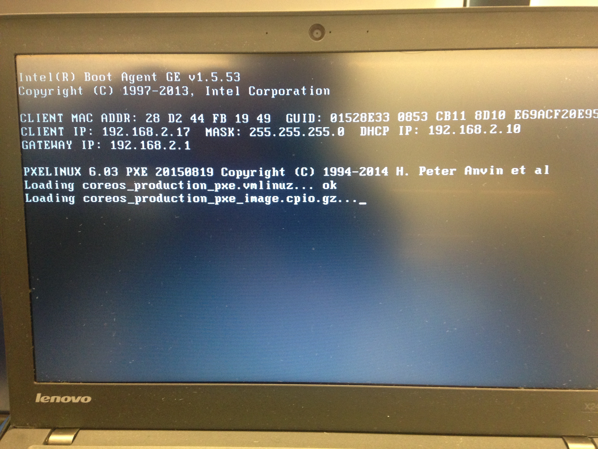

# PXE in the Office

This document describe the procedure to setup a Raspberry Pi a PXE
server that can boot and auto-install CoreOS on target computers
connected to the same router.  The described procedure follows
[Li Peng's tutorial](https://github.com/k8sp/bare-metal-coreos).
Minor differences include that we use a 32-bit Raspberry Pi with
ARMv7l CPU and Raspbian Linux 8.


## Table of Contents

   * [The Cluster](#the-cluster)
   * [DHCP Server](#dhcp-server)
     * [DHCP Server's Static IP](#dhcp-servers-static-ip)
     * [DHCP Configuration](#dhcp-configuration)
     * [Switch DHCP Service](#switch-dhcp-service)
   * [TFTP Server](#tftp-server)
     * [Deploy PXELINUX](#deploy-pxelinux)
     * [Deploy CoreOS Images](#deploy-coreos-images)
   * [Boot CoreOS](#boot-coreos)
     * [Configure PXELINUX](#configure-pxelinux)
     * [Test PXE Booting](#test-pxe-booting)
   * [Install CoreOS](#install-coreos)
     * [HTTP Server](#http-server)
     * [CoreOS Installation Images](#coreos-installation-images)
     * [install-coreos.sh](#install-coreossh)
     * [cloud-config Files](#cloud-config-files)
   * [Pitfalls](#pitfalls)
     * [DHCP Configuration Error Checking](#dhcp-configuration-error-checking)
     * [DNS Server Configuration](#dns-server-configuration)
     * [CoreOS Suppoted Deivce Types](#coreos-suppoted-deivce-types)
	  
## The Cluster

I have a LinkSys router.  I plug its upstream cable to the Ethernet
slot on the wall of the office.  As shown in the following figure, I
plugged three downstream cables to

1. a MacBook Pro from which I ssh to other nodes.
1. a Raspberry Pi used as the PXE server, and
1. a Lenovo Thinkpad X240 running Ubuntu.

The Raspberry Pi is supposed to be the PXE server.  I want it able to
boot and auto-install CoreOS on the Thinkpad.  Here is a picture
showing the small cluster (with an undocumented Mac Mini).


After booting all these computers, they got IP addresses from the router:

1. MacBook Pro: 192.168.2.10
1. Raspberry Pi: 192.168.2.11
1. Thinkpad: 192.168.2.12
1. SysLink router: 192.168.2.1

I can configure the router via a Web UI at `http://192.168.2.1`, where
`192.168.2.1` is the static IP of the router.  This Web UI allows me
to disable/enable the DHCP service on the router.  At this moment, I
keep it as "enabled".  The default IP address allocation range is from
`192.168.2.10` to `192.168.2.249`.

On this Web UI, I can see that the subnet mask is `255.255.255.0`.

I can ssh to the Thinkpad and the Raspberry Pi from the MacBook Pro.
On both of these Linux comptuers, I confirmed that `route -n` returns
the gateway IP address as `192.168.2.1`, which is the router's IP
address.

On all these computers, I did `curl www.gooogle.com` and verified that
I can access the Internet.


## DHCP Server

A PXE server is a DHCP server that returns not only the IP address,
but also URL of boot images that will be used to boot the target
computer.

I learned about DHCP server on Ubuntu from
[this tutorial](http://www.noveldevices.co.uk/rp-dhcp-server).  To
install a DHCP server:

```
sudo apt-get install isc-dhcp-server
```

### DHCP Server's Static IP

A PXE server needs a static IP address, so that target computers know
from where to download the OS images.  To do this, I edited
`/etc/network/interfaces` to assign `eth0` a static IP address
`192.168.2.10`.

```
auto eth0
iface eth0 inet static
address 192.168.2.10
netmask 255.255.255.0
gateway 192.168.2.1
dns-nameservers 8.8.4.4 8.8.8.8
```

### DHCP Configuration

Then I rewrote `/etc/dhcp/dhcpd.conf` to make the DHCP server
allocating IP addresses in the range from `192.168.2.11` to
`192.168.2.249`.  Please be aware that I reserve `192.168.2.10` for
the DHCP (PXE) server itself.

```
subnet 192.168.2.0 netmask 255.255.255.0 {
	range 192.168.2.11 192.168.2.249;
	option routers 192.168.2.1;
	option broadcast-address 192.168.2.255;
	option domain-name-servers 8.8.8.8;
}

next-server 192.168.2.10;
filename "pxelinux.0";
```

Also, please be aware that `next-server` and `filename` together
indicates the boot image path as `tftp://192.168.2.10/pxelinux.0`.  We
will talk about this TFTP service later.

Please refer to
[DHCP Configuration Error Checking](#dhcp-configuration-error-checking)
for a pitfall I encountered here.

Now we can restart the server to make the configuration happen:

```
sudo service isc-dhcp-server restart
```

### Switch DHCP Service

I now disable the DHCP service on the router via its Web UI.  Then I
restarted the Thinkpad.  After it reboots, it got new IP address
`192.168.2.13`.  It seems that the Raspberry Pi DHCP server works.

I can ssh to Thinkpad using its new IP address.

Then I restarted the Raspberry Pi.  It boots into a status that the
DHCP server runs OK and it can resovle and access `www.google.com`.

Then I restarted the Thinkpad again.  It got `192.168.2.15`, an IP
address in the specified range.


## TFTP Server

I followed
[this tutorial for Ubuntu](http://vinobkaranath.blogspot.com/2014/06/install-tftp-server-in-ubuntu-1404.html)
and installed tftpd-hpa.  A difference is that I use the default TFTP
serving path `/srv/tftp`.

To test the TFTP server, I installed a client: `sudo apt-get install
tftp-hpa`, then run

```
echo Hello > /srv/tftp/hello
tftp 192.168.2.11 -c  get hello
cat ./hello
Hello
```

It is noticable that the server is listening on `192.168.2.11`, but
not on `127.0.0.1` (`localhost`).


### Deploy PXELINUX

The boot image aforementioned in DHCP configuraton file was retrieved
from the pxelinux package:

```
sudo apt-get install pxelinux syslinux-common
cp /usr/lib/PXELINUX/pxelinux.0 /srv/tftp/
cp /usr/lib/syslinux/modules/bios/ldlinux.c32 /srv/tftp/
```

Then I checked that the Thinkpad can get `pxelinux.0` and
`ldlinux.c32` from the TFTP server running on the Raspberry Pi:

```
ssh yi@192.168.2.16
> tftp 192.168.2.10 -c get pxelinux.0
> tftp 192.168.2.10 -c get ldlinux.c32
```

### Deploy CoreOS Images

On the Raspberry Pi,

```
cd /srv/tftp
CHANNEL=stable
VERSION=1010.5.0
wget https://${CHANNEL}.release.core-os.net/amd64-usr/${VERSION}/coreos_production_pxe.vmlinuz
wget https://${CHANNEL}.release.core-os.net/amd64-usr/${VERSION}/coreos_production_pxe_image.cpio.gz
```

We can also verify the downloaded image files:

```
wget https://${CHANNEL}.release.core-os.net/amd64-usr/${VERSION}/coreos_production_pxe.vmlinuz.sig
wget https://${CHANNEL}.release.core-os.net/amd64-usr/${VERSION}/coreos_production_pxe_image.cpio.gz.sig
gpg --verify coreos_production_pxe.vmlinuz.sig
gpg --verify coreos_production_pxe_image.cpio.gz.sig
```

You might wonder how come the `CHANNEL` and the `VERSION` variables,
which tells that the most recent stable channel of CoreOS releases the
1010.5.0 version.  We can always get the up-to-date version of the
stable channel by accessing
https://stable.release.core-os.net/amd64-usr/current/version.txt.

## Boot CoreOS

### Configure PXELINUX

The idea that we need pxelinux.0 is that, when a target computer
boots, it broadcasts a request for IP address.  The DHCP server
responses an IP address and `next-server` and `filename`.  If the
network card and BIOS of the target computer supports PXE, it would
download the boot image from URL `tftp://192.168.2.10/pxelinux.0` and
keep this URL as *current working directory*.  When it runs
`pxelinux.0`, it lets it knows the current working directory, so that
`pxelinux.0` can load its configuration file from there.

Suppose that the MAC address of the network card on the target
computer is `28-d2-44-fb-19-49`, then `pxelinux.0` will read
configuration file
`tftp://192.168.2.10/pxelinux.cfg/01-88-99-aa-bb-cc-dd`.  If that
file doesn't exists, it tries to read
`tftp://192.168.2.10/pxelinux.cfg/default`.

The content of our `/srv/tftp/pxelinux.cfg/default` is as
follows:

```
default coreos

label coreos
  kernel coreos_production_pxe.vmlinuz
  append initrd=coreos_production_pxe_image.cpio.gz cloud-config-url=http://192.168.2.10/install-coreos.sh
```

This configuration file tells `pxelinux.0` to download CoreOS images
`coreos_production_pxe.vmlinuz` and
`coreos_production_pxe_image.cpio.gz` from its current working
directory.  Then `pxelinux.0` will boot the system using the CoreOS
images.

Please be aware that the URL
`http://192.168.2.10/install-coreos.sh` in above
cloud-config file doesn't exist at the moment.  We will talk about
this later.

### Test PXE Booting

Now, restart the Thinkpad and hold Enter to enter the BIOS setup
interface.  Change the boot order so that Network Boot is on top of
the list.  Then save and exit.  Now the Thinkpad should boot CoreOS as
follows:




## Install CoreOS

Above steps allows us to boot a CoreOS on the Thinkpad from Raspberry
Pi PXE server.  This CoreOS system mounts a in-memory `tmpfs`
filesystem at the root mount point `/`.  However, we usually want
CoreOS installed on to local disks, so we don't rely on the PXE server
everytime we boot a target computer.

To do so, we can make use of the cloud-config mechanism of CoreOS.
Everytime CoreOS boots, it executes a cloud-config file.  This
cloud-config file could be a YAML file, which will be interpreted and
translated to some system configuration files, or, more flexibly, a
Shell script, which is executed directly.  In above steps, we let the
PXE-booted in-memory CoreOS executes
`http://192.168.2.10/install-coreos.sh` after
booting.  We can draft this script to call `coreos-install`, a
standard Shell script distributed with CoreOS, to install CoreOS onto
the local disk.

`coreos-install` does three things:

1. Download the CoreOS installation image and the corresponding
   signature file from a HTTP server specified with the `-b` command
   line parameter.  We will make the Raspberry Pi the HTTP server.

1. Install the image to a device specified with the `-d` command line
   flag.  The specified device need to be a *disk*-typed device.  For
   more information, please refer to
   [this pitfall](#coreos-suppoted-deivce-types).

1. Copy the cloud-config file specified with the `-c` command line
   parameter to be `/var/lib/coreos-install/user_data`.  Then,
   everytime the newly installed CoreOS system boots from disk, it
   will execute this cloud-config file.  We can use this cloud-config
   file to install and configure systems like etcd and Kubernetes.
   

### HTTP Server

To host `http://192.168.2.10:8080/install-coreos.sh` and
the CoreOS installation image etc, we install Nginx on 192.168.2.10,
the Raspberry Pi PXE server:

```
sudo apt-get update
sudo apt-get install nginx
```

Nginx serves files in directory `/var/www/html`.  To test that the
Nginx server is running:

```
cd /var/www/
sudo chown -R pi html
cd html
echo World > world
```

Then access Nginx from the MacBook Pro:

```
curl http://192.168.2.10/world
World
```

### CoreOS Installation Images

Download the CoreOS installation images and corresponding signature files:

```
cd /var/www/html
mkdir 1010.5.0
cd 1010.5.0
wget https://stable.release.core-os.net/amd64-usr/1010.5.0/coreos_production_image.bin.bz2
wget https://stable.release.core-os.net/amd64-usr/1010.5.0/coreos_production_image.bin.bz2.sig
```

### `install-coreos.sh`

Put the following `install-coreos.sh` file in `/var/www/html`.

```
#!/bin/sh
mac_addr=`ifconfig | grep -A2 'broadcast' | grep -o '..:..:..:..:..:..'`
wget http://192.168.2.10/cloud-configs/${mac_addr}.yml
sudo coreos-install -d /dev/sda -c ${mac_addr}.yml -b http://192.168.2.10
sudo reboot
```

This script gets the MAC address of the first network card `eth0`, and
makes the YAML file with the same name as the MAC address the
cloud-config file.  This allows us to specify the cloud-config file
for each computer.  We need this property because some computers will
be configured to run etcd, some others to run Kubernetes master nodes,
and yet some others to run Kubernetes worker nodes.

### cloud-config Files

For our very simple case that we don't configure the Thinkpad to run
etcd or Kubernetes, our cloud-config file,
`/var/www/html/cloud-configs/28:d2:44:fb:19:49.yml`, is very simple --
it just add an SSH key to the installed CoreOS.

```
#cloud-config
ssh_authorized_keys:
  - ssh-rsa AAAAB3N...
```

## Review and Launch

After these steps, the directory structure in `/var/www/html` would
look like:

```
pi@raspberrypi:/var/www/html $ tree
.
├── 1010.5.0
│   ├── coreos_production_image.bin.bz2
│   └── coreos_production_image.bin.bz2.sig
├── cloud-configs
│   └── 28:d2:44:fb:19:49.yml
├── index.nginx-debian.html
└── install-coreos.sh
```

and the directory structure of `/srv/tftp` should look like:

```
pi@raspberrypi:/var/www/html $ tree /srv/tftp
/srv/tftp
├── coreos_production_pxe_image.cpio.gz
├── coreos_production_pxe.vmlinuz
├── hello
├── ldlinux.c32
├── pxelinux.0
└── pxelinux.cfg
    └── default
```

Then all we need is to press the power button of the Thinkpad and
reboot it.  This will boot the Thinkpad from the PXE server and starts
CoreOS installation.  After the installation, the last line `sudo
reboot` in `/var/www/html/install-coreos.sh` will reboot the Thinkpad
again.  This time, we need to hold Enter to get into the BIOS
configuration UI and change the boot order to be disk first, so that
following boots will be from the disk.

In a more realistic case, we would add new computers (without OS'es
installed on their disks) into the network, and we wouldn't change the
default booting order -- let it just be disk first and network later.
The first time we press the power button will boot these new computers
via PXE server; and once the initial booting installs CoreOS onto
local disks, all following bootings will be from local disks.


## Pitfalls

### DHCP Configuration Error Checking

When I start the DHCP server as follows, it complains and error:

```
pi@raspberrypi:/etc/dhcp $ sudo service isc-dhcp-server restart
Job for isc-dhcp-server.service failed. See 'systemctl status isc-dhcp-server.service' and 'journalctl -xn' for details.
```

But `systemctl status isc-dhcp-server.service` and `journalctl -xn` shows nothing interesting.

So I had a look at the file `/etc/init.d/isc-dhcp-server`, which is a
Shell script and invokes `/usr/sbin/dhcpd`.  This inspired me to run
`/usr/sbin/dhcpd` from the command line, which shows the reason -- I
got syntax errors in the configuration file:

```
pi@raspberrypi:/etc/dhcp $ /usr/sbin/dhcpd
Internet Systems Consortium DHCP Server 4.3.1
Copyright 2004-2014 Internet Systems Consortium.
All rights reserved.
For info, please visit https://www.isc.org/software/dhcp/
Config file: /etc/dhcp/dhcpd.conf
Database file: /var/lib/dhcp/dhcpd.leases
PID file: /var/run/dhcpd.pid
unable to create icmp socket: Operation not permitted
/etc/dhcp/dhcpd.conf line 8: semicolon expected.
filename 
 ^
/etc/dhcp/dhcpd.conf line 8: expecting a declaration

^
Configuration file errors encountered -- exiting
```

I simply added the missing semicolons, then `sudo service
isc-dhcp-server start` works and `systemctl status
isc-dhcp-server.service` shows that the service is running well.

### DNS Server Configuration

When I switched to use the DHCP service on the Raspberry Pi from using
that on the router, `curl www.google.com` on the Thinkpad failed:

```
yi@pxe:~$ curl www.google.com
curl: (6) Could not resolve host: www.google.com
```

A brute force solution is to edit `/etc/resolv.conf` on the Thinkpad
and add a line `nameserver 8.8.8.8`.  For CoreOS target computers, the
same brute force solution can be done by adding lines into the
cloud-config file:

```
write_files:
  - path: "/etc/resolv.conf"
    permissions: "0644"
    owner: "root"
    content: |
       nameserver 8.8.8.8
```	

But an elegant solution is to add a line to the `/etc/dhcp/dhcpd.conf`
on the Raspberry Pi:

```
option domain-name-servers 8.8.8.8;
```

Then we can restart the DHCP server

```
sudo service isc-dhcp-server restart
```

On the Thinkpad, we release the old lease and renew it:

```
sudo dhclient -r
sudo dhclient
```

Or, of couse, we can restart the Thinkpad.  Now `curl www.google.com`
should work on the Thinkpad.

For more information about configuring DHCP server on Ubuntu (or
Raspbian), please refer to
[this document](https://help.ubuntu.com/community/isc-dhcp-server).


### CoreOS Suppoted Deivce Types

`coreos-install` invokes `lsblk` to check the device type, and by
documents, it accepts three device types: *disk*, *loop*, and *LVM*.
However, only *disk* is a viable choice in practice.  This is because
that `coreos-install` creates a partition table on the device, and
invokes `blockdev --rereadpt <device>` to load this partition table;
however, `blockdev` cannot read partition tables in LVM devices nor
loop devices.
