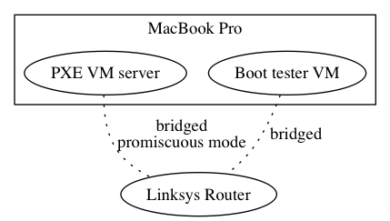

# PXE in VM

I want to be able to test the auto-installation of Kubernetes cluster
on a VM cluster.  To do this, I need to set up a PXE server in this VM
cluster and use it to boot other VMs.

## VM HDCP Server

To test that if a VM could be a DHCP server, I created two VMs --
[pxe-vm](./pxe-vm) and [boot-tester-vm](./boot-tester-vm) on my
MacBook Pro using Vagrant.  The pxe-vm's
[provisioning script](./pxe-vm/bootstrap.sh) configures a DHCP server.
This script is a script representation of steps listed in the PXE on
Raspberry Pi
[tutorial](https://github.com/k8sp/bare-metal-coreos/tree/master/pxe-on-rasppi).

It is notable that both pxe-vm and boot-tester-vm have *bridged*
network, so logically, they connect directly to the LinkSys router.  I
guess that I might be create a VirtualBox host-only network to mimic
the real LinkSys router.  I might try that later.

It is important to manually configure the bridged network on pxe-vm to
the *promiscuous mode*.
